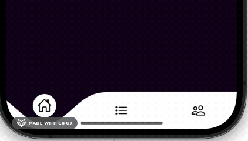

# React Native Shared UI

React Native Shared UI is a collection of reusable UI components designed to streamline the development of your React Native applications. This library simplifies the process of creating consistent and stylish user interfaces across different platforms.

## Installation

To get started, you can install the package via npm:

```bash
npm install @browntreebear/reactnativesharedui
```

## Available Scripts

- **start:** Start the Expo development server.
```bash
npm start
```

- **ios:** Start the Expo development server in ios.
```bash
npm run ios
```

- **type-check:** Run typescript check.
```bash
npm run type-check
```

## Available Components

-**Buttons**
```bash
import { AppButton } from '@browntreebear/reactnativesharedui/components'

<AppButton 
    // Some optional styling you can send to the button
    optionalStyling={{ alignSelf: 'center' }}  
    text="Logout" // <- Button Text
    onPress={() => {}} // <- Button action
    buttonStyle={{ backGroundColor: "#255433", textColor: "#E0E0E0" }} // <- button style
/>
```

-**Loaders**
```bash
import { FullScreenLoader, ApplicationLoader, PageLoader } 
from '@browntreebear/reactnativesharedui/components'

<ApplicationLoader/>
<PageLoader loaderColor="white"/>
<FullScreenLoader loaderColor="grey" visible={true}/>
```

-**TabBar**
- note: this was built with routing built on @react-navigation/native
    -make sure content above (each tab) the nav bar has a style of flex: 1 to push the navbar to the bottom of the page

```bash
import { TabBar } 
from '@browntreebear/reactnativesharedui/animations'

const tabs = [
    {
        name: 'Home',
        item: Any React node icon works here. . I use Iconicons,
    },
    {
        name: 'MyList',
        item: <Iconicons color="black" size={25} name="list-outline" />,
    },
    {
        name: 'Settings',
        item: <Iconicons color="black" size={25} name="people-outline" />,
    }

<NavigationContent>
    <View style={{ flex: 1 }}>
        {state.routes.map((route, i) => {
            const isHidden = shouldHideTabBar(route.name);
            const isCurrentTab = i === state.index;
                return (
                    <View
                        key={route.key}
                        style={[
                            StyleSheet.absoluteFill,
                        { display: isHidden ? 'none' : 'flex' },
                        { zIndex: isCurrentTab ? 1 : 0 },
                    ]}
                    >
                    {isCurrentTab && descriptors[route.key].render()}
                </View>
            )
        })}
    </View>
    <View style={styles.tabBar}>
        <TabBar tabs={tabs} onTabChange={handleTabNavigation} backGroundColor="#10001A" />
    </View>
</NavigationContent>
```

